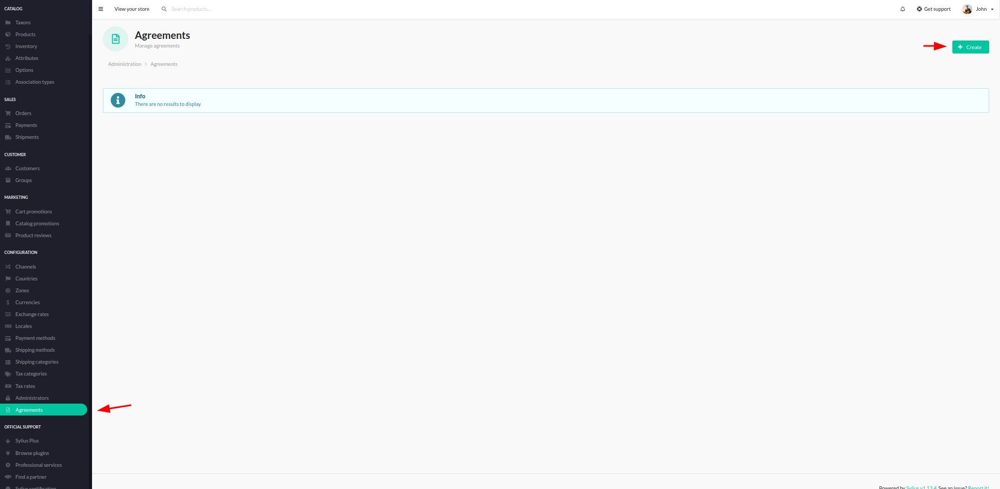
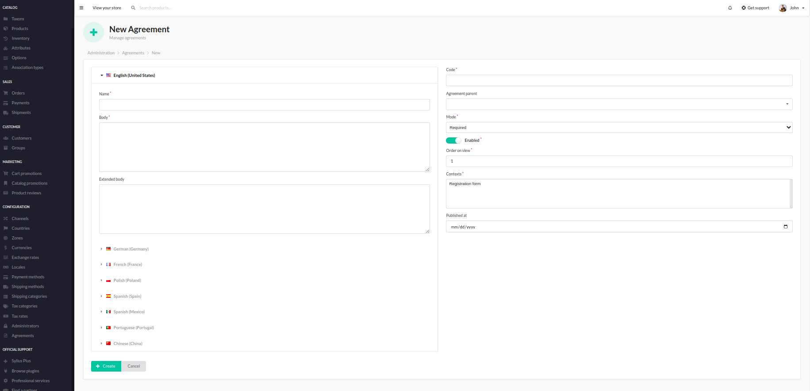
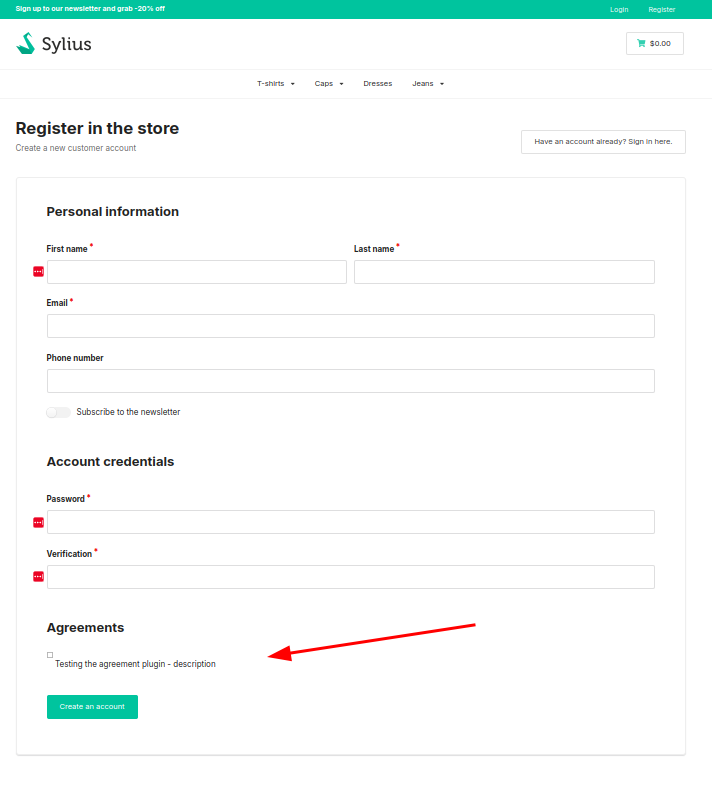

# Functionalities

---

The SyliusAgreementPlugin adds the functionality of defining, managing, and attaching agreement clauses and checkboxes to forms in your Sylius store.

Once installed, it has access to the Agreements section, where all created agreements are listed.

    

The plugin provides a special configuration form to create agreements. It is possible to choose the name, code, place where it should be displayed, date of publication, and mode (if the agreement is required or not).

    

Created and enabled agreements are now displayed in the chosen place. For example, under the registration form in the shop.

    

